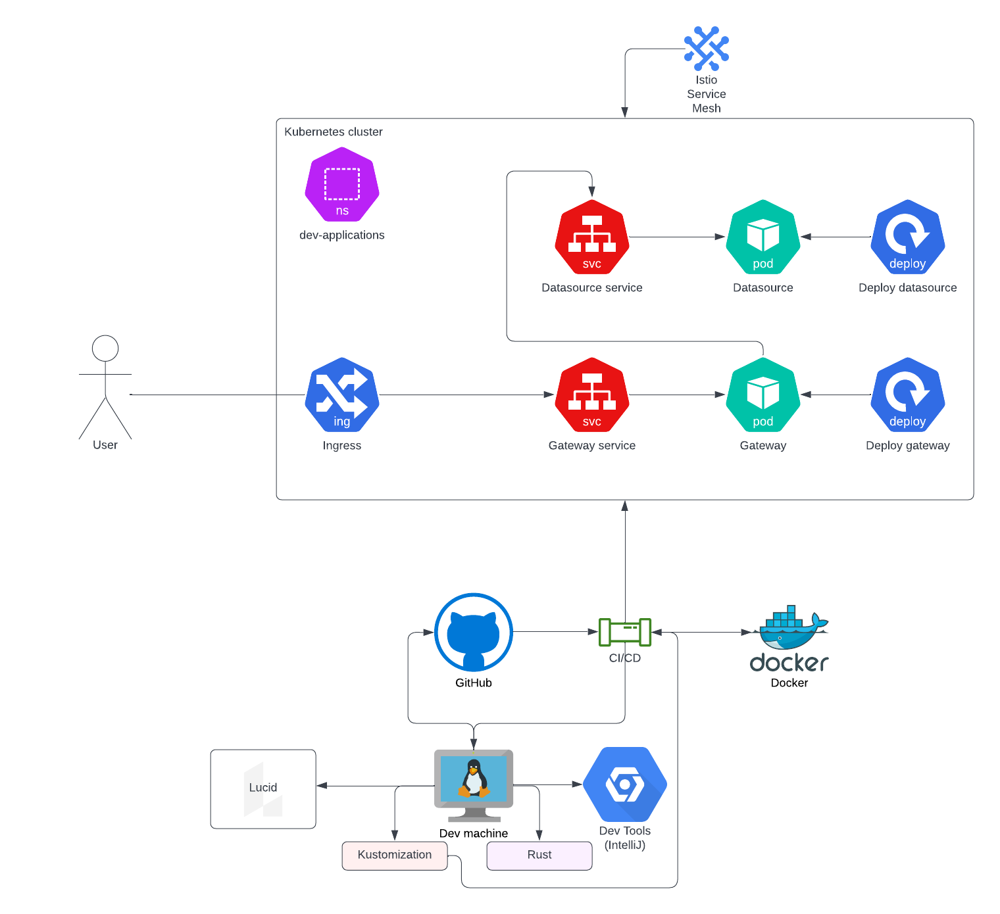
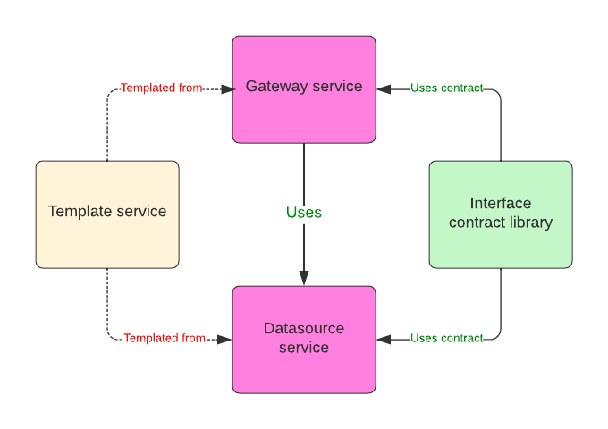

# Goal 
 This is a project that is built while studying for the K8s certification. 
 It is a full stack project from application to deployment. 

 This will include 
 - Two applications in Rust using the Rocket webserver framework with a shared interface definition library and a template project.
 - Kustomize: For having one codebase for kubernetes and a set of variations per environment
 - Kubernetes: Several ways of using kubernetes in this project
   - Build it yourselves with another [project](https://github.com/phiroict/training_k8s_cluster)
   - Use minikube (See below)
 - Using a service mesh `istio` for zero trust inner service encryption.
 - Using encryption for ingoing connections (TLS / istio certs? )
 - Tests framework created in jmeter for content and saturation tests. 
 - CI: Jenkins container (todo)
 - CD: ArgoCD (todo)
  


# Stack
- A Linux system (this has been developed on an Arch linux machine, should work fine on other distros as well) 
  - MacOS -> This is now the ARM platform so many container images need to be build for this platform, this is out of scope for this training. Good luck.
  - MacOS and Windows use VM when running docker containers so this solution may not work without faffing network settings, again, outside scope and again, Good luck.
  - For archlinux there is an ansible configuration playbook at `infra/ansible/dev-machine/playbook.yaml`, ran from the `make init_ansible` task.
- git
- kubectl
- kubernetes cluster 
- kustomize
- make (or CMake)
- istio (It will be overwritten during some make tasks, this is just for bootstrapping)
- rustup / rustc
- kvm2 / qemu (There are other virtualisation platforms you can use, check the `Minikube` section of the make file as how to create them - I have been using the kvm2 stack as it is opensource)
- jmeter

Optional:
- minikube
- wireshark


# Implementation setup

## Setup 
Flow of the setup is: 
- [if using archlinux] run `make init_archlinux` [install make first or run the commandline from the makefile directly]
- [other oses] install the stack above
- Then run the `make provision_minikube` 

## Shortcuts 
For the examples add: 
```text
alias k=kubectl 
```
to your  `.profile` or `.bashrc` or equivalent.

## Local machine
[Arch linux] To use the opensource kvm2 version of minikube, follow the [instructions](`https://gist.github.com/grugnog/caa118205ad498423266f26150a5d555`) 

## Kubernetes

### Build cluster yourself
There is a project to set up a complete cluster : `https://github.com/phiroict/training_k8s_cluster` you can use to create a cluster yourself. There are many more ways to create a cluster, this is one of them.


### Use minikube. 
If you are less interested in the inner workings of kubernetes, you can use minikube, a cluster you can run locally on a machine with at least 36 GiB RAM. 
In the make file there are four ways to create these minikube stacks.
If you do not that much memory you can change the settings, by for instance using fewer nodes and memory. Note that tools like istio need a lot of resources so if you 
notice that pods are failing with OOMErrors you need to increase memory per node. It is better to have fewer nodes than memory. 
On linux, the kvm2 minikube is recommended.  

```makefile
## Minikube start commands with several drivers
minikube_podman:
	minikube config set rootless true
	minikube start --driver podman --container-runtime containerd  --nodes 4 --cpus 2 --memory 8000M
	minikube addons enable ingress
minikube_docker:	
	minikube start --driver docker  --nodes 4 --cpus 2 --memory 8000M
	minikube addons enable ingress
minikube_virtualbox:
	minikube start --driver virtualbox --nodes 4 --cpus 2 --memory 8000M
	minikube addons enable ingress
minikube_kvm2:
	minikube start --driver kvm2 --nodes 4 --cpus 2 --memory 8000M
	minikube addons enable ingress
```
These create the stack on several virtualization platforms. If you are an experience user with one of these, use these. There are more platforms available by the way, these
were the three I tested it on.
More info [here](https://minikube.sigs.k8s.io/docs/drivers/)  
More info about [minikube](https://minikube.sigs.k8s.io/docs/)  

## Makefile 

To document commands and keep them in sync with use we use a Makefile as the main local pipeline and task runner.
The tasks defined in there are: 

| Make task                       | description                                                                                                                                      |
|---------------------------------|--------------------------------------------------------------------------------------------------------------------------------------------------|
| init_archlinux                  | For a linux machine these are the preamble settings and applications.                                                                            |
| init_ansible                    | Does the same as the first but now using ansible                                                                                                 |
| create_user                     | Example of creation of a user with creation of the SSL certs needed --reference only                                                             |
| create_readonly_role_sa         | Example of creation of a service account -reference only                                                                                         |
| create_sa_token_dashboard_admin | Example of a token generation for a sa account (kubectl>1.21 no longer does this automatically)                                                  |
| init_namespaces                 | Creates the namespaces we use, as we add other components on the namespace we do not want to delete / create it with the rest of the infra stack |
| deploy_dev                      | Deploy the infra & applications on the dev environment, uses kustomize.                                                                          |
| deploy_test                     | Deploy the infra & applications on the test environment, uses kustomize.                                                                         |
| deploy_uat                      | Deploy the infra & applications on the uat environment, uses kustomize.                                                                          |
| deploy_prod                     | Deploy the infra & applications on the prod environment, uses kustomize.                                                                         |
| undeploy_dev                    | Remove infra for dev (save namespace)                                                                                                            |
| undeploy_test                   | Remove infra for test (save namespace)                                                                                                           |
| undeploy_uat                    | Remove infra for uat (save namespace)                                                                                                            |
| undeploy_prod                   | Remove infra for prod (save namespace)                                                                                                           |
| app_init                        | Setup rust for nightly build use (Rocket, the service framework needs that)                                                                      |
| app_build_gateway               | Build the gateway microservice application                                                                                                       |
| app_build_datasource            | Build the datasource microservice application                                                                                                    |
| app_build_all                   | Build all the microservices                                                                                                                      |
| app_run_all                     | Run the microservices locally on the machine.                                                                                                    |
| app_build_gateway_release       | Build the Rust release version                                                                                                                   |
| app_build_datasource_release    | Builds the Rust release version                                                                                                                  |
| app_build_all_release           | Build all release versions                                                                                                                       |
| app_container_gateway           | Create the docker image for the gateway microservice                                                                                             |
| app_container_datasource        | Create the docker image for the datasource microservice                                                                                          |
| app_container_build_all         | Build all containers for the microservices                                                                                                       |
| docker_compose_run              | Run the images in a docker compose stack locally                                                                                                 |
| docker_compose_stop             | Stop and delete local docker compose stack                                                                                                       |
| minikube_podman                 | Create k8s cluster using podman (Does not need a docker engine running, only needs containerd)                                                   |
| minikube_docker                 | Create k8s cluster using docker (Needs running docker engine)                                                                                    |
| minikube_virtualbox             | Create k8s cluster on virtualbox. VB needs to be installed, but you would not need containerization on you local machine                         |
| minikube_kvm2                   | Create k8s cluster on kvm / qemu (recommended way on linux)                                                                                      |
| minikube_delete                 | Delete and erase minikube from your system                                                                                                       |
| minikube_set_hosts              | Get the minikube gateway ip address and places it in the /etc/hosts file                                                                         |
| istio_init                      | Install istio in the cluster using defaults                                                                                                      |
| istio_init_arm                  | Installs istio on the cluster on the ARM platform (Mac M1/2 platform)                                                                            |
| istio_inject                    | Injects istio in namespaces                                                                                                                      |
| istio_extras                    | Installs extra tools for istio, kialis, prometheus, grafana, etc.                                                                                |
| istio_extras_arm                | Installs extra tools for istio, kialis, prometheus, grafana, etc.                                                                                |
| minikube_dashboard              | Shows the k8s dashboard                                                                                                                          |
| kiali_dashboard                 | Sows the kiali dashboard                                                                                                                         |
| concourse_init                  | Downloads concourse CI on k8s, creates the `ci` namespace                                                                                        |
| concourse_keygen                | Generate keys for concourse                                                                                                                      |
| concourse_create                | Creates the stack for concourse, needs init and keygen to have run at least once                                                                 |
| concourse_delete                | Remove the concourse stack, leaves the `ci` namespace                                                                                            
| concourse_all                   | Runs complete concourse installation                                                                                                             |
| concourse_web                   | Opens the concourse web site                                                                                                                     |
| provision_minikube              | Builds the complete kubernetes stack with apps, services, istio, and concourse                                                                   |
| provision_mac_arm_kube          | Builds the complete kubernetes stack with apps, services, istio, and concourse  for ARM                                                          |
| bounce_minikube                 | Tear down and completely rebuild the k8s stack.                                                                                                  |

# Design and use
This is a complete stack development. This chapter will list some design choices.

## Main flow
In the whole stack these are the main components. Some details are omitted, we get to them later. 



## Application flow
From the apps folder we have two applications that are the applications that will run on the pods.  
They are created from a template service project `service_template` setting up things like logging and
some configuration of the Rust / Rocket configuration.

The interface contract are captured in the Interface contract library: `application_interfaces` these
are used by both services.  


## CI 

We use a tool concourse that runs in its own namespace. 
It is created separately by the following make tasks

| make task        | description                                                                                                                                                                      |
|------------------|----------------------------------------------------------------------------------------------------------------------------------------------------------------------------------|
| concourse_init   | Run once to download concourse and create the `ci` namespace                                                                                                                     | 
| concourse_keygen | Generate the keys we use for setting up the stack, you need to run this before any `concourse_create` as the secrets are deleted from the system after applying it to kubernetes | 
| concourse_create | Create the stack, assumes `concource_init` and `concourse_keygen` have run                                                                                                       |
| concourse_delete | Clean up the stack except the `ci` namespace                                                                                                                                     |
| concourse_all | Runs concourse_init, keygen and create in one go for convenience |

# Appendixes 
## Convenient commands 

### set namespace default 

```bash
k config set-context --current  --namespace dev-applications
```

# Kubernetes actions 
## Create users 

```bash
bash create_certificate.sh <NAME>
```

Create a role and associate it to the user 

```yaml
kind: ClusterRole
apiVersion: rbac.authorization.k8s.io/v1
metadata:
  name: readonly-for-all
rules:
- apiGroups: ["*"]
  resources: ["*"]
  verbs: ["get", "list", "watch"]
- nonResourceURLs: ["*"]
  verbs: ["get", "list", "watch"]
---
kind: ClusterRoleBinding
apiVersion: rbac.authorization.k8s.io/v1
metadata:
  name: readonly-for-test
subjects:
- kind: User
  name: <user>
  apiGroup: rbac.authorization.k8s.io
roleRef:
  kind: ClusterRole
  name: readonly-for-all
  apiGroup: rbac.authorization.k8s.io
```

Now change to that user 

```bash
k config use-context <user>
```

Change back to the administrator
```bash
k config use-context kubernetes-admin@kubernetes
```

## Service accounts 

Create like this: 

```yaml
---
apiVersion: v1
kind: ServiceAccount
metadata:  
  name: dev-deploy-principal
  namespace: dev-applications
---
apiVersion: v1
kind: Secret
metadata:
  name: sa-dev-deploy-token
  annotations:
    kubernetes.io/service-account.name: dev-deploy-principal
type: kubernetes.io/service-account-token  
```
Note that since k8s 1.24 the secret is no longer automatically generated, this is not well documented as yet, so we generate the secret as is depicted.


## Environments 

We use `kustomize` to render the environments for the kubernetes setup. 
Note that it needs an external app installed, there is an integrated version in kubectl itself, but it is barely maintained. 

The scripts are in the `stack/kustomize` folder, and you call them from that folder with:

[env is one of `{dev,test,uat,prod}`]

```bash
kustomize build overlays/<env>
```
Apply with

```bash
kubectl apply -k overlays/<env>
```
Remove with:
```bash
kubectl delete -k overlays/<env>
```

# Issues
## Issue context [solved]

There seems to be a bug in the set-credentials where it should be:

```yaml
- context:
    cluster: kubernetes
    user: phiroict
```

but it is 

```yaml
- context:
    cluster: ""
    user: ""
```
So the context change cannot find the cluster. 
Solved, missed the settings in the set-context should be this
```bash
kubectl config set-context ${TARGET_USER} --cluster=kubernetes --user=${TARGET_USER} --namespace=default
```

## concourse create pipeline 
```bash
cd ci/concourse/pipeline/apps
cat build-microservice-gateway.yaml | fly -t main set-pipeline --pipeline ms-build-gateway --config -
```