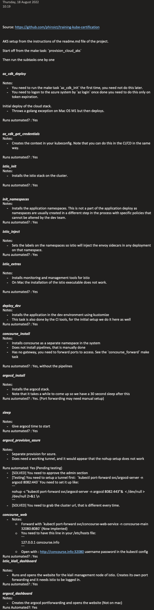

# Goal 
 This is a project that is built while studying for the K8s certification, and slowly turned into a full stack development
 that can be deployed on cloud and local clusters.  
 It is a full stack project from application to deployment, its aim is to be able to be provisioned 95%+ automated.

Most of the documentation can be read in the [wiki](https://github.com/phiroict/training-kube-certification/wiki)
Check out the wiki [by](git@github.com:phiroict/training-kube-certification.wiki.git) 
This readme will contain developer setup notes and observations, all other documentation is in the [wiki](https://github.com/phiroict/training-kube-certification/wiki). 


# Setup your development environment 

## Stack

You need to install these applications to run this stack. 

- A Linux system (this has been developed on an Arch linux machine, should work fine on other distros as well) 
  - MacOS -> This is now the ARM platform so many container images need to be build for this platform, this is out of scope for this training. Good luck.
  - MacOS and Windows use VM when running docker containers so this solution may not work without faffing network settings, again, outside scope and again, Good luck.
  - For archlinux there is an ansible configuration playbook at `infra/ansible/dev-machine/playbook.yaml`, ran from the `make init_ansible` task.
- git
- kubectl
- kubernetes cluster 
- kustomize
- make (or CMake)
- istio (It will be overwritten during some make tasks, this is just for bootstrapping)
- rustup / rustc
- kvm2 / qemu (There are other virtualisation platforms you can use, check the `Minikube` section of the make file as how to create them - I have been using the kvm2 stack as it is opensource)
- jmeter
- ansible
- bash
- make 

Optional but useful:
- minikube
- wireshark
- k9s (Commandline k8s maintenance) 
- azure-cli
- aws-cli
- aws-vault
- gcloud  


# Implementation setup

## TL;DR; express setup
Run the following make steps:

### Initial 
Run the make tasks, or the commands therein: 

- `init_archlinux` (Or equivalent for your OS)
- `concourse_init`
- Manual: Set the secrets in `ci/concourse/secrets` [see](https://github.com/phiroict/training-kube-certification/wiki/Secrets-And-Security#concourse)
  - git.creds
  - docker.creds 
- `provision_minikube`

We are also implementing cloud deployments (Azure AKS, AWS EKS, and Google GKS) initially we will set up 
azure AKS as we need to sort ingress and access. This would be slightly different for the cloud providers as these can 
use load balancers to export traffic. There are several ways of access the cloud applications -> By port forwarding, (not for production) or istio gateways.   

We keep you posted as we go along. 

## Building the applications

See the [wiki](https://github.com/phiroict/training-kube-certification/wiki/Micro-Services)

## Setup password files 
See concourse [passwords](https://github.com/phiroict/training-kube-certification/wiki/Secrets-And-Security#concourse)

## Setup 
Flow of the setup is: 
- [if using archlinux] run `make init_archlinux` [install make first or run the commandline from the makefile directly]
- [other oses] install the stack above
- Then run the `make provision_minikube` 

## Shortcuts 
For the examples add: 
```text
alias k=kubectl 
```
to your  `.profile` or `.bashrc` or equivalent.

## Local machine
[Arch linux] To use the opensource kvm2 version of minikube, follow the [instructions](`https://gist.github.com/grugnog/caa118205ad498423266f26150a5d555`) 

## Kubernetes

### Build cluster yourself
There is a project to set up a complete cluster : `https://github.com/phiroict/training_k8s_cluster` you can use to create a cluster yourself. There are many more ways to create a cluster, this is one of them.


### Use minikube. 
See [here](https://github.com/phiroict/training-kube-certification/wiki/Kubernetes-Cluster-Provision#minikube)
### Azure AKS 
See [here](https://github.com/phiroict/training-kube-certification/wiki/Kubernetes-Cluster-Provision###AKS-Azure)
### AWS EKS
See [here](https://github.com/phiroict/training-kube-certification/wiki/Kubernetes-Cluster-Provision###EKS-AWS)
 

## Makefile 

To document commands and keep them in sync with use we use a Makefile as the main local pipeline and task runner.
The tasks defined in there are: 

| Make task                        | description                                                                                                                                      |
|----------------------------------|--------------------------------------------------------------------------------------------------------------------------------------------------|
| init_archlinux                   | For a linux machine these are the preamble settings and applications.                                                                            |
| init_ansible                     | Does the same as the first but now using ansible                                                                                                 |
| create_user                      | Example of creation of a user with creation of the SSL certs needed --reference only                                                             |
| create_readonly_role_sa          | Example of creation of a service account -reference only                                                                                         |
| create_sa_token_dashboard_admin  | Example of a token generation for a sa account (kubectl>1.21 no longer does this automatically)                                                  |
| init_namespaces                  | Creates the namespaces we use, as we add other components on the namespace we do not want to delete / create it with the rest of the infra stack |
| deploy_dev                       | Deploy the infra & applications on the dev environment, uses kustomize.                                                                          |
| deploy_test                      | Deploy the infra & applications on the test environment, uses kustomize.                                                                         |
| deploy_uat                       | Deploy the infra & applications on the uat environment, uses kustomize.                                                                          |
| deploy_prod                      | Deploy the infra & applications on the prod environment, uses kustomize.                                                                         |
| undeploy_dev                     | Remove infra for dev (save namespace)                                                                                                            |
| undeploy_test                    | Remove infra for test (save namespace)                                                                                                           |
| undeploy_uat                     | Remove infra for uat (save namespace)                                                                                                            |
| undeploy_prod                    | Remove infra for prod (save namespace)                                                                                                           |
| app_init                         | Setup rust for nightly build use (Rocket, the service framework needs that)                                                                      |
| app_build_gateway                | Build the gateway microservice application                                                                                                       |
| app_build_datasource             | Build the datasource microservice application                                                                                                    |
| app_build_all                    | Build all the microservices                                                                                                                      |
| app_run_all                      | Run the microservices locally on the machine.                                                                                                    |
| app_build_gateway_release        | Build the Rust release version                                                                                                                   |
| app_build_datasource_release     | Builds the Rust release version                                                                                                                  |
| app_build_all_release            | Build all release versions                                                                                                                       |
| app_container_gateway            | Create the docker image for the gateway microservice                                                                                             |
| app_container_datasource         | Create the docker image for the datasource microservice                                                                                          |
| app_container_build_all          | Build all containers for the microservices                                                                                                       |
| docker_compose_run               | Run the images in a docker compose stack locally                                                                                                 |
| docker_compose_stop              | Stop and delete local docker compose stack                                                                                                       |
| minikube_podman                  | Create k8s cluster using podman (Does not need a docker engine running, only needs containerd)                                                   |
| minikube_docker                  | Create k8s cluster using docker (Needs running docker engine)                                                                                    |
| minikube_virtualbox              | Create k8s cluster on virtualbox. VB needs to be installed, but you would not need containerization on you local machine                         |
| minikube_kvm2                    | Create k8s cluster on kvm / qemu (recommended way on linux)                                                                                      |
| minikube_delete                  | Delete and erase minikube from your system                                                                                                       |
| minikube_set_hosts               | Get the minikube gateway ip address and places it in the /etc/hosts file                                                                         |
| istio_init                       | Install istio in the cluster using defaults                                                                                                      |
| istio_init_arm                   | Installs istio on the cluster on the ARM platform (Mac M1/2 platform)                                                                            |
| istio_inject                     | Injects istio in namespaces                                                                                                                      |
| istio_extras                     | Installs extra tools for istio, kialis, prometheus, grafana, etc.                                                                                |
| istio_extras_arm                 | Installs extra tools for istio, kialis, prometheus, grafana, etc.                                                                                |
| minikube_dashboard               | Shows the k8s dashboard                                                                                                                          |
| kiali_dashboard                  | Sows the kiali dashboard                                                                                                                         |
| concourse_init                   | Downloads concourse CI on k8s, creates the `concourse-main` namespace                                                                            |
| concourse_keygen                 | Generate keys for concourse                                                                                                                      |
| concourse_create                 | Creates the stack for concourse, needs init and keygen to have run at least once                                                                 |
| concourse_delete                 | Remove the concourse stack, leaves the `concourse-main` namespace                                                                                |
| concourse_all                    | Runs complete concourse installation                                                                                                             |
| concourse_web                    | Opens the concourse web site                                                                                                                     |
| provision_minikube               | Builds the complete kubernetes stack with apps, services, istio, and concourse                                                                   |
| provision_mac_arm_kube           | Builds the complete kubernetes stack with apps, services, istio, and concourse  for ARM                                                          |
| bounce_minikube                  | Tear down and completely rebuild the k8s stack.                                                                                                  |
| argocd_install                   | Install the argcd component in its separate namespace                                                                                            |
| argocd_dashboard                 | open the argocd dashboard, note that you need to get the secret as password from k8s see `### Get the password for argocd`                       |
| argocd_get_initial_password      | Extracts the password from kubernetes to be able to log in                                                                                       | 
| argocd_provision                 | Create the projects                                                                                                                              |
| argocd_provision_azure           | Same but for azure (there are some processes that work differently there)                                                                        |
| provision_cloud_aks              | First part of the provisioning of the azure stack                                                                                                |
| provision_cloud_aks_continuation | second part after checking if the argocd instance was started correctly                                                                          |
| az_provision                     | One go provisioning for azure with a long sleep before argocd is on line                                                                         |
| az_login                         | Logon to the azure account                                                                                                                       |
| az_cdk_init                      | Initialize the cdktf project                                                                                                                     |
| az_cdk_get                       | Install providers for cdktf                                                                                                                      |
| az_cdk_synth                     | Compile the cdktf code into terraform                                                                                                            |
| az_cdk_deploy                    | Logon to the azure account                                                                                                                       |
| az_cdk_get_credentials           | Generate the kubernetes configuration and authentication                                                                                         |
| az_cdk_destroy                   | Erase the azure stack.                                                                                                                           |
| aws_wa_init                      | runs the init / upgrade terraform task                                                                                                           | 
| aws_wa_patch                     | Patches the faulty `cdk.tf.json` file                                                                                                            | 
| aws_wa_plan                      | plans the terraform script                                                                                                                       | 
| aws_wa_apply                     | applies the terraform script                                                                                                                     | 
| aws_wa_destroy                   | destroy the terraform script                                                                                                                     | 
| provision_cloud_aws              | all above tasks, with patch                                                                                                                      | 
| deprovision_cloud_aws            | destroy the terraform script, with patch                                                                                                         | 


# Design and use
This is a complete stack development. This chapter will list some design choices.


## CI 
See the [wiki](https://github.com/phiroict/training-kube-certification/wiki/CI#ci---concourse)

## CD 
See the [wiki](https://github.com/phiroict/training-kube-certification/wiki/CI#cd---argocd)

# Appendixes 
## Convenient commands 

### set namespace default 

```bash
k config set-context --current  --namespace dev-applications
```

# Kubernetes actions 
## Create users 

```bash
bash create_certificate.sh <NAME>
```

Create a role and associate it to the user 

```yaml
kind: ClusterRole
apiVersion: rbac.authorization.k8s.io/v1
metadata:
  name: readonly-for-all
rules:
- apiGroups: ["*"]
  resources: ["*"]
  verbs: ["get", "list", "watch"]
- nonResourceURLs: ["*"]
  verbs: ["get", "list", "watch"]
---
kind: ClusterRoleBinding
apiVersion: rbac.authorization.k8s.io/v1
metadata:
  name: readonly-for-test
subjects:
- kind: User
  name: <user>
  apiGroup: rbac.authorization.k8s.io
roleRef:
  kind: ClusterRole
  name: readonly-for-all
  apiGroup: rbac.authorization.k8s.io
```

Now change to that user 

```bash
k config use-context <user>
```

Change back to the administrator
```bash
k config use-context kubernetes-admin@kubernetes
```

## Service accounts 

Create like this: 

```yaml
---
apiVersion: v1
kind: ServiceAccount
metadata:  
  name: dev-deploy-principal
  namespace: dev-applications
---
apiVersion: v1
kind: Secret
metadata:
  name: sa-dev-deploy-token
  annotations:
    kubernetes.io/service-account.name: dev-deploy-principal
type: kubernetes.io/service-account-token  
```
Note that since k8s 1.24 the secret is no longer automatically generated, this is not well documented as yet, so we generate the secret as is depicted.


## Environments 

We use `kustomize` to render the environments for the kubernetes setup. 
Note that it needs an external app installed, there is an integrated version in kubectl itself, but it is barely maintained. 

The scripts are in the `stack/kustomize` folder, and you call them from that folder with:

[env is one of `{dev,test,uat,prod}`]

```bash
kustomize build overlays/<env>
```
Apply with

```bash
kubectl apply -k overlays/<env>
```
Remove with:
```bash
kubectl delete -k overlays/<env>
```

# Issues
## Issue context [solved]

There seems to be a bug in the set-credentials where it should be:

```yaml
- context:
    cluster: kubernetes
    user: phiroict
```

but it is 

```yaml
- context:
    cluster: ""
    user: ""
```
So the context change cannot find the cluster. 
Solved, missed the settings in the set-context should be this
```bash
kubectl config set-context ${TARGET_USER} --cluster=kubernetes --user=${TARGET_USER} --namespace=default
```

## concourse login
```bash
fly --target main login --concourse-url http://concourse.info:32080/
source <(fly completion --shell bash)
```

## concourse create pipeline 
```bash
cd ci/concourse/pipelines/apps
cat build-microservice-gateway-dev.yaml | fly -t main set-pipeline --pipeline ms-build-gateway --config -
```


## ArgoCD 
### Get the password for argocd

Now get the secret for login

```bash
kubectl -n argocd get secret argocd-initial-admin-secret -o jsonpath="{.data.password}" | base64 -d
```

# Notes on setup

## AKS

